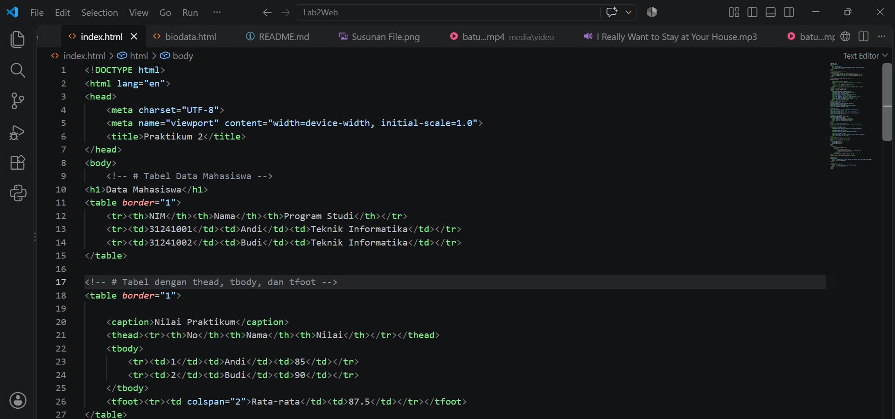
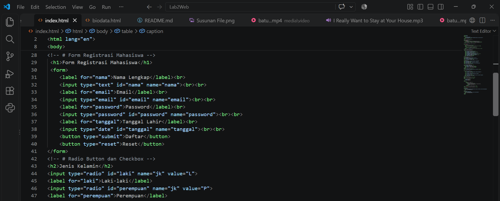
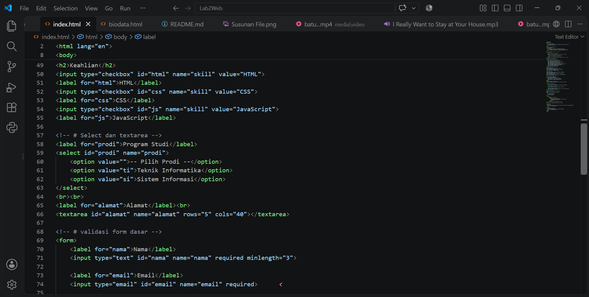
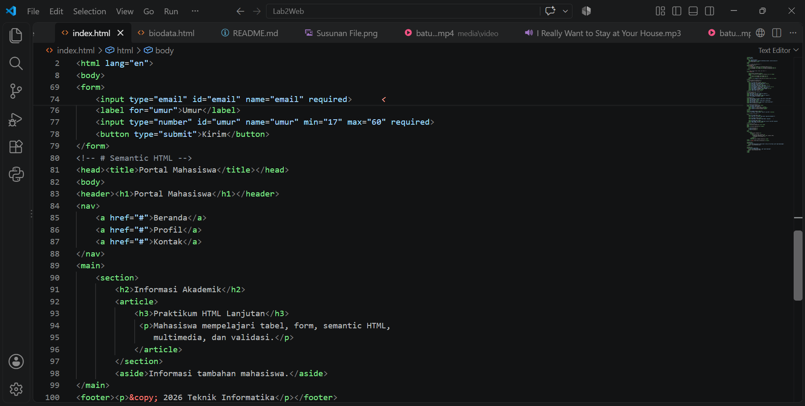
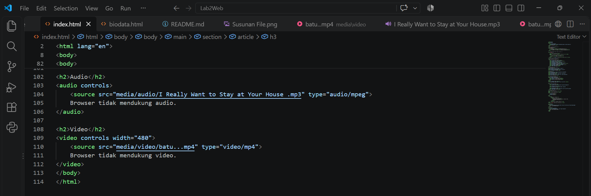
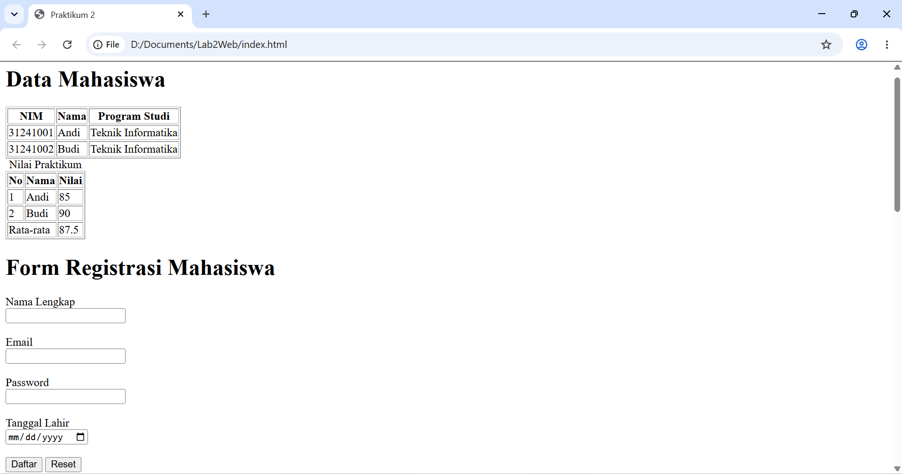
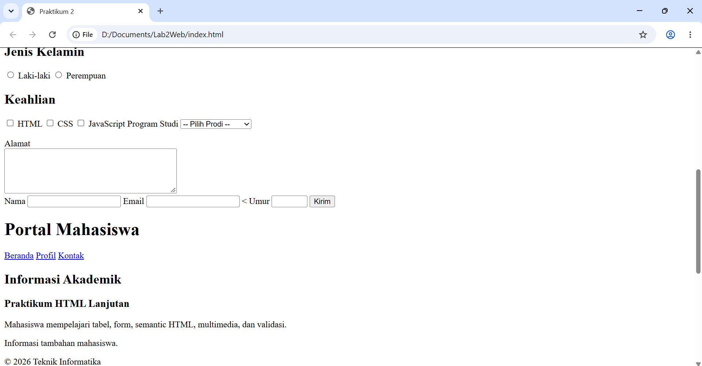
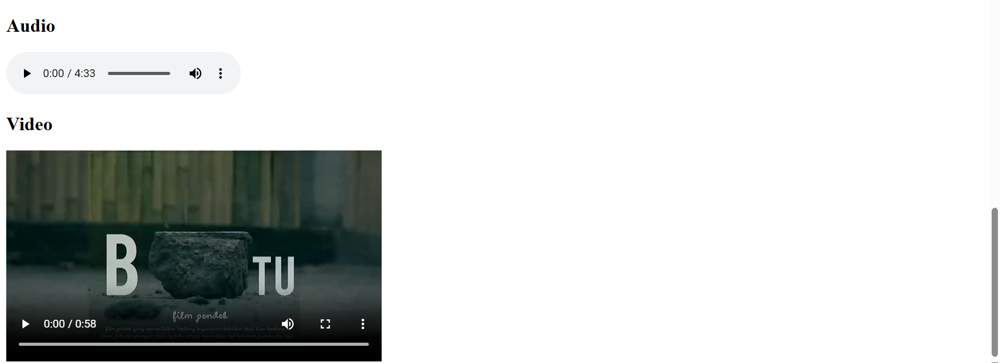

# Lab2Web - Praktikum 2 HTML Lanjutan

Nama : Siti Azka Ikrima
Kelas : 312510315
Mata Kuliah : Pemrograman Web (Praktikum 2 HTML lanjutan)

# Soal
1. Apa fungsi `<table>`, `<tr>`, dan `<td>`?
2. Apa perbedaan `<th>` dan `<td>`?
3. Apa fungsi `colspan` pada tabel?
4. Apa fungsi `<form>` dalam HTML?
5. Apa perbedaan radio button dan checkbox?
6. Mengapa sebaiknya `<label>` terhubung dengan `id` input melalui atribut `for`?
7. Apa perbedaan `<textarea>` dengan `<input type="text">`?
8. Apa fungsi semantic HTML seperti `<header>`, `<nav>`, `<main>`, `<section>`, `<article>`, `<footer>`, dan `<aside>`?
9. Apa fungsi `required`, `min`, `max`, dan `minlength`?
10. Apa perbedaan elemen `block` dan `inline`?

# Jawab

1. `<table>` digunakan untuk membuat tabel, `<tr>` untuk membuat baris tabel, dan `<td>` untuk membuat sel data pada tabel.
2. `<th>` digunakan untuk membuat sel header/judul pada tabel, sedangkan `<td>` digunakan untuk membuat sel data.
3. `colspan` digunakan untuk menggabungkan beberapa kolom menjadi satu.
4. `<form>` digunakan untuk membuat formulir yang dapat digunakan untuk menerima data dari pengguna.
5. Radio button digunakan untuk memilih satu pilihan dari beberapa pilihan, sedangkan checkbox memungkinkan pengguna memilih lebih dari satu pilihan.
6. Agar pengguna dapat mengklik teks label untuk memilih atau mengaktifkan input yang terkait.
7. `<textarea>` digunakan untuk memasukkan teks yang lebih panjang dan dapat terdiri dari beberapa baris, sedangkan `<input type="text">` umumnya digunakan untuk teks satu baris.
8. Semantic HTML digunakan untuk memberikan struktur dan makna yang jelas pada bagian-bagian halaman web.
9. `required` membuat input wajib diisi, `min` menentukan nilai minimum, `max` menentukan nilai maksimum, dan `minlength` menentukan jumlah karakter minimum.
10. Elemen block biasanya mengambil satu baris penuh, sedangkan elemen inline hanya menggunakan ruang sesuai isi elemennya.

# Praktikum 2
Code

Web

## Hasil Mini Projek 

